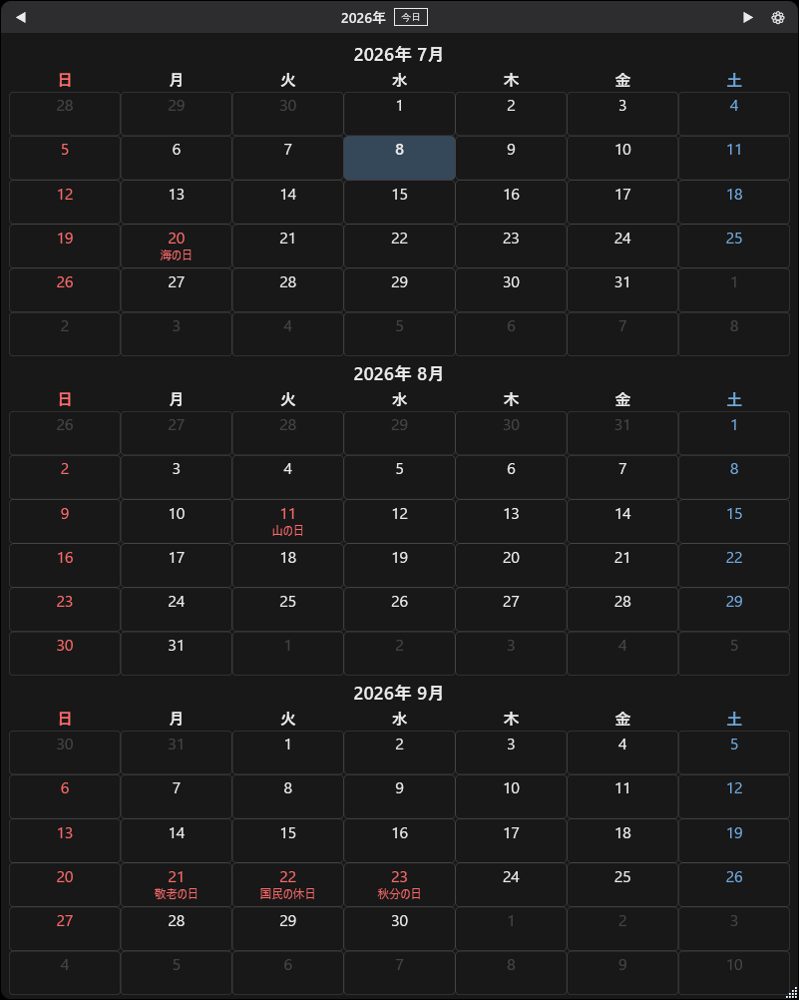

# YMB デスクトップカレンダー

更新が止まった「壁カレ4」の代替として作った、Windows常駐型デスクトップカレンダー。
C# + WPF製。祝日情報をネットから自動取得し、常に最新の状態を保つ。



## 主な機能

- **デスクトップ常駐表示**: 壁紙の上(WorkerW層)にウィンドウを固定するデスクトップピン留めに対応。
  環境によってはWorkerWの検出に失敗するため、その場合は自動的に通常ウィンドウ表示にフォールバック。
- **複数月表示**: 設定で1〜3ヶ月を横並び表示可能。ウィンドウ幅に合わせて各月パネルが均等に伸縮する
  リキッドレイアウト。
- **祝日自動取得**: [holidays-jp API](https://holidays-jp.github.io/) から年単位で取得し、
  `%APPDATA%`配下にキャッシュ(7日間有効、オフライン時はキャッシュにフォールバック)。
- **日付メモ**: 日付クリックで簡易メモを登録。メモがある日はマーカー表示。
- **テーマ切替**: Light / Dark / Pastel の3種類。
- **トレイ常駐**: 表示/非表示切替、クリックスルー(壁紙操作をそのまま透過)のトグル、
  更新確認、終了。クリックスルー中は操作できないボタン・リサイズグリップを自動的に隠す。
- **Windows起動時に自動起動**: 設定画面からON/OFF可能(レジストリRunキーに登録)。
- **本体の更新確認**: GitHub Releasesの最新版と現在のバージョンを比較し、
  起動時に自動チェック+トレイメニューから手動チェックも可能。

## 使い方

- ヘッダーの `◀` `▶`: 表示月を前後に移動。
- `⚙`: 設定画面(テーマ・表示月数・デスクトップ常駐・クリックスルー・自動起動)。
- 日付セルをクリック: メモの登録・編集。
- タイトルバー相当の帯をドラッグ: ウィンドウ移動。
- トレイアイコン右クリック: 表示/非表示・クリックスルー・更新確認・終了。

## 開発環境のセットアップ

```
cd src/KabeCale.App
dotnet build
dotnet run
```

## 技術スタック

- **言語/フレームワーク**: C# / .NET 10 (`net10.0-windows`) + WPF
- **祝日データ**: [holidays-jp API](https://holidays-jp.github.io/api/v1/{year}/date.json)
- **デスクトップ常駐**: Progman/WorkerWトリック(`Native/DesktopPin.cs`、user32.dll P/Invoke)
- **トレイアイコン**: Windows Forms の `NotifyIcon`(`UseWindowsForms`併用)
- **設定/データ永続化**: JSON、`%APPDATA%\YmbDesktopCalendar\`配下に保存(DB不使用)
- **インストーラー**: Inno Setup(`installer/setup.iss`)、日本語ローカライズ・per-userインストールでUAC不要
- **CI/CD**: GitHub Actions(`.github/workflows/release.yml`)、mainへのpushで
  publish→インストーラービルド→GitHub Release公開まで自動化

データ保存先: `%APPDATA%\YmbDesktopCalendar\`(`settings.json`、`memos.json`、`holidays_<year>.json`)

## ダウンロード

ビルド不要で使う場合は [Releases](https://github.com/yumebi/ymb_desktop_calendar/releases/latest) から
`YmbDesktopCalendar-Setup-<version>.exe` をダウンロードして実行するだけでインストールできる
(self-contained、.NETランタイム別途インストール不要)。

> **注意**: このインストーラーはコード署名されていません。ダウンロード・実行時に
> Windows SmartScreenが「不明な発行元」として警告を表示する場合があります。
> 「詳細情報」→「実行」で続行できます。

## ライセンス

[MIT License](LICENSE) © 2026 yumebi
